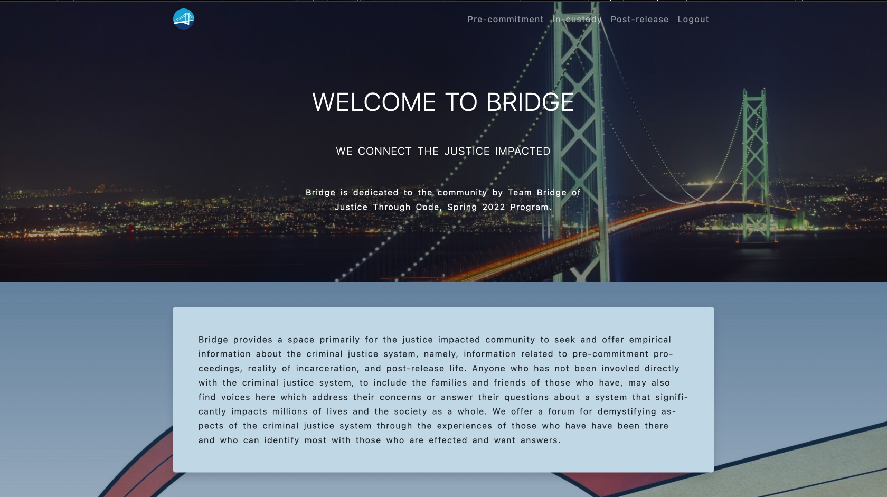

<p align="center"></p>
<h2 align="center">Bridge App</h2>
<h4 align="center">Bryan Garrett, Chung Kao, Richard Lee, Anthony Lopez</h4>
<p align="center">Columbia University - Justice Through Code</p>
<p align="center"></p>

  

## About

The Bridge web app is a collaborative project undertaken by the Spring 2022 participants of Columbia University's Justice Through Code program. It is built with Python on the Django framework that constituted the final project as per program requirement.

The app is conceived as a forum in which community members may seek or offer information on topics intimate to the justice-impacted population. It seeks to connect those who are concerned about entering or exiting the corrections system with those who can offer information or insight specific to such conerns. Using the app's interactive message board anyone can ask a question, and anyone may offer an experiential response to the question, concerning any of the three broadly categorized areas of concern, namely, pre-commitment, in-custody, and post-release. In this way Bridge offers a wealth of information for persons and the families and friends of persons who come in the justice system.

### Usage

The following commands are for Mac and Linux users. Windows users please execute equivalent commands.

To clone a copy of this project using https, run the following command in the command line:

```bash
$ git clone https://github.com/ponyNYC/bridge_2022.git <your_project_directory_name>
```

To clone using SSH run the following command:

```bash
$ git clone git@github.com:ponyNYC/bridge_2022.git <your_project_directory_name>
```

Create a Python virtual environment and activate it in your local project: (assuming you already have Python3 installed)

```bash
$ cd <your_project_directory_name>
$ python3 -m venv venv
$ . venv/bin/activate
```

Install the packages from `requirements.txt`:

```bash
$ pip install -r requirements.txt
```

Then you need to create a `SECRET_KEY` that is not committed to source control, but is necessary for running the app. In the same directory as `<your_project_directory_name>/bridge/bridge/settings.py` file, create a `.env` file and, in it, save a secret key that you create. You may generate a key in the terminal like so:

```bash
$ shasum<<<test
```

A hash will be generated and printed to the terminal, which you can use as the key, or you can just type a string of alphanumberics mixed with punctuation symbols as you like, and save it in the `.env` file, like so:

```.env
SECRET_KEY=<the_hash_you_generated>
```

Next migrate to apply database schema and populate tables and fields per the models:

```bash
$ cd bridge
$ python3 manage.py migrate
```

Then get the server running:

```bash
$ python3 manage.py runserver
```

And you should see the app's homepage at `localhost:8000`.

You now have a Bridge app in which people may post questions and write answers to the questions.

Please let us know of any bugs and imperfections. Your input will be greatly appreciated. In case you decide to tweak the app further, please push up a branch to show us what you have done so we may learn form it.

### Contributors

[](https://github.com/BuckG71) [](https://github.com/Sanlung) [](https://github.com/rlee794) [](https://github.com/ponyNYC)

### License

MIT license
